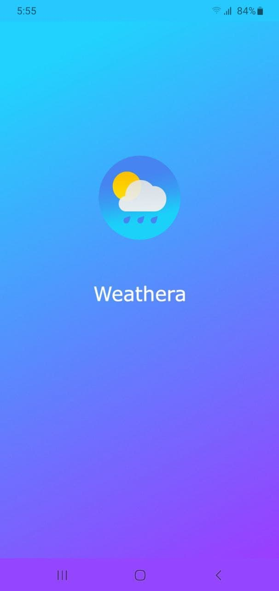
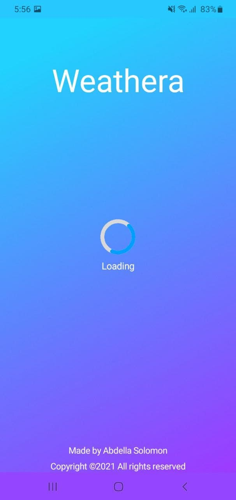
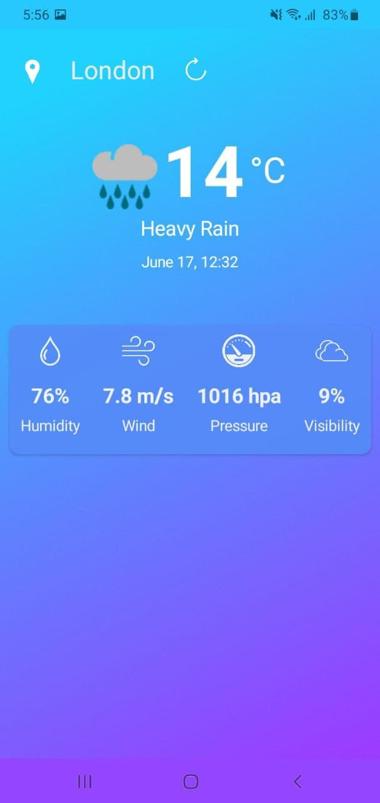
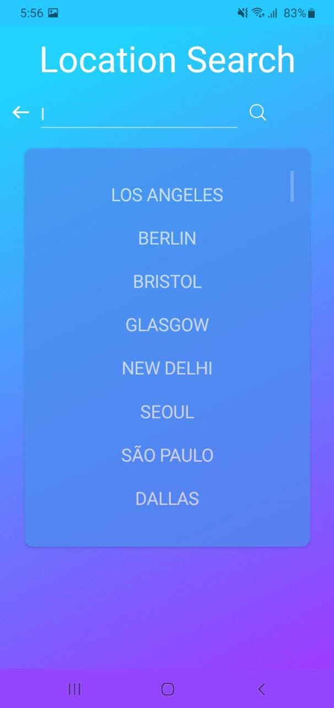

# Weathera
Weathera is a weather app that works on Android phone. It is made using C# framework called xamarin. 
This app will automatically detect your current location and also you can view other cities weather status. 
The last city you viewed will be saved as the default location.
If you are disconnected from internet, still you can use the app. You can view the last refresh you did in the app.

 
 

# Appearance
<b>
 
 
 
 

 
 

# Release
If you want to try the app you can download it on play store following this link https://play.google.com/store/apps/details?id=com.abdesol.weathera or if you want to download the app directly go with this link https://github.com/Abdesol/Weathera/releases/.

 
 

# Limitations
1. The code works in code behind way. No MVVM architecture :(
2. The metaweather.com api sometimes doesn't respond.
3. Heavy Weight.

 

# Contribution
Any contribution is acceptable. Especially, if someone will be helping me fix the above limitations, I am very thankfull :)
